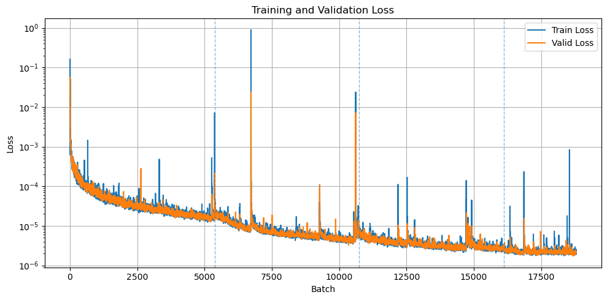

# Dense Retrieval for hep-th arXiv

## Introduction

This project builds a semantic search engine for the high-energy theoretical physics (hep-th) arXiv. Instead of relying on titles, abstracts, or keyword matching, the system operates on the full text of papers. Each document is split into smaller text chunks, and a neural network encodes these chunks into dense vector representations. User queries are embedded in the same space, and the system retrieves the most semantically relevant passages in the corpus. The goal is to enable fast, meaning-aware search that can locate the exact sections where specific ideas or constructions are discussed.

The retrieval model is a Transformer-based encoder that maps token sequences to fixed-size embeddings. The model uses a 256-dimensional token representation, four Transformer layers, eight attention heads per layer, and feed-forward blocks of size 640 with a dropout rate of 0.1, and produces a 256-dimensional output embedding.

The dataset consists of five years of hep-th arXiv submissions from 2021 to 2025, including cross-listed papers, for a total of over 36,000 documents. After removing equations, citations, figures, and other LaTeX artifacts, the cleaned corpus is approximately 1.6 GB of text. The corpus was divided into about 885,000 chunks, and a custom vocabulary of roughly 43,000 tokens was built from this data.

The model was trained for three epochs with a context length of 160 tokens. The parameters were chosen to yield an approximate training time of 15 hours per epoch on a 32 GB Mac M1 system, which was used for this project. After that, the model was trained for an additional half epoch at a context length of 320 tokens, which matches the average chunk length of the constructed corpus and the embedding size used during retrieval.

---
 
## What it does

- Data extraction and processing
  - Retrieves source files for arXiv articles in a given category (hep-th by default) over a specified date range.
  - Splits articles into sections and converts them into clean text by removing LaTeX artifacts, environments, and custom macros.
  - Builds a corpus by subdividing sections into overlapping chunks of a specified character length.
- Model training
  - Builds a word-level vocabulary from the corpus and encodes chunks as token IDs.
  - Pads or truncates chunks to a fixed sequence length and constructs train and validation dataloaders.
  - Trains a Transformer encoder with a contrastive objective in a dual-encoder setup and records per-batch training and validation loss.
- Retrieval functionality
  - Computes dense embeddings for all chunks in the corpus.
  - Encodes the user query and performs a fast similarity search to retrieve a set of likely candidate chunks.
  - Reranks the candidates with the encoder to promote the most semantically relevant papers to the top, and returns the final ranked list of papers.

---

## Project structure

The project is organized into several main directories:

- `/notebooks` contains a Jupyter notebook that demonstrates the model’s architecture, training, and retrieval results.
- `/src` includes the core Python code:
  - `scraper.py` for downloading and preparing arXiv data.
  - `model.py` for the neural network and embedding logic.
- When running from scratch, a `/data` folder will be created with the following contents:
  - `/raw` contains `source.tar.gz` files for all downloaded articles.
  - `/processed` contains the processed versions of these articles, split into sections.
  - `/corpus` contains:
    - `chunks.jsonl` contains unencoded text chunks.
    - `chunk_embeddings.pt` contains encoded chunks.
    - `chunk_ids.json` contains chunk metadata for fast retrieval.
  - `metadata.jsonl` contains article metadata.
- `/model` contains the pretrained model and related files:
  - `model.pt` with the pretrained model weights.
  - `vocab.jsonl` with the corresponding vocabulary.
  - `history.pt` with per-batch training and validation loss history.

---

## Pretrained model

The `/model` folder contains a pretrained encoder stored in `model.pt`. The model was trained for three and a half epochs on a corpus of roughly 885,000 chunks built from hep-th arXiv publications between 2021 and 2025. The corresponding vocabulary, containing about 43,000 words, is provided in `vocab.jsonl`.

The encoder is a Transformer-based model with a 256-dimensional token representation, four self-attention layers, and eight attention heads per layer. Each layer uses a feed-forward block of size 640 with a dropout rate of 0.1. The model produces a 256-dimensional output embedding and does not use positional encoding, so it remains largely agnostic to the input sequence length within reasonable limits.

Training was primarily performed with a sequence length of 160 tokens, followed by an additional half-epoch at a context length of 320 tokens. The average chunk length in the corpus is about 320 tokens, so chunks were truncated during the main training stage. Truncation was applied randomly and independently at each epoch, which ensured that the model still saw the vast majority of the data before the transition to the 320-token context stage.

Training and validation loss history is stored in `history.pt` and plotted below.



The accompanying notebook provides step-by-step instructions on how to use the model to perform dense reranking in conjunction with a fast lexical similarity search, in order to retrieve the most relevant papers from the corpus.

---

## Ranking methods

Using dense retriever networks for ranking is not as straightforward as it might initially seem. Dense scores are not always a direct improvement over lexical search; in practice, they often work best as a complement to it. A detailed discussion of the different ranking methods and the regimes where each performs well is given in the notebook. Here we present a brief summary.

Consider the following prompt:

```
prompt = (
    "Finite-coupling exact results for N = 4 SYM form factors of local operators "
    "as expansions around the collinear limits of null-polygons, "
    "obtained through the use of integrability methods."
)
```

This prompt contains several specific technical terms, but overall it remains fairly vague in the context of high energy theory. As a whole, however, it is well suited to identifying a particular sequence of papers written by the author of this project and collaborators between 2021 and 2025. In particular, the following four papers should be expected to rank highly:

- **2308.08432:** *Wilson Loop Duality and OPE for Super Form Factors of Half-BPS Operators* by Benjamin Basso, Alexander G. Tumanov
- **2209.06816:** *Analytic Four-Point Lightlike Form Factors and OPE of Null-Wrapped Polygons* by Yuanhong Guo, Lei Wang, Gang Yang
- **2112.10569:** *An Operator Product Expansion for Form Factors III. Finite Coupling and Multi-Particle Contributions* by Amit Sever, Alexander G. Tumanov, Matthias Wilhelm
- **2105.13367:** *An Operator Product Expansion for Form Factors II. Born level* by Amit Sever, Alexander G. Tumanov, Matthias Wilhelm

After retrieving the top 5000 lexical candidate chunks, we find mixed results:

```
Paper rankings before dense reranking:
2308.08432: present, rank =  247, score =  0.233014
2209.06816: present, rank = 1542, score =  0.169453
2112.10569: present, rank =    3, score =  0.361611
2105.13367: present, rank = 1619, score =  0.167905
```

One of the papers, `2112.10569`, ranked appropriately high at rank 3, which suggests a strong lexical match with substantial vocabulary overlap with the prompt. Another paper, `2308.08432`, landed in a middle-of-the-road position, while the other two papers were not flagged by the lexical similarity search at all. The simplest next step is to apply dense reranking to all 5000 retrieved chunks, completely replacing their lexical scores. This yields:

```
Paper rankings after dense reranking:
2308.08432: present, rank =    1, score =  0.410493
2209.06816: present, rank = 1003, score =  0.099015
2112.10569: present, rank =  415, score =  0.176434
2105.13367: present, rank =  258, score =  0.203030
```

This leads to some major improvements. Paper `2308.08432` rises all the way to rank 1, while `2209.06816` and `2105.13367` both improve significantly. The problem is `2112.10569`, which drops substantially in the ranking. This is a common pattern for dense retrievers. Neural encoders gain the ability to capture broader context, but in doing so they often lose some of the precision of direct lexical matching. As a result, semantically relevant but previously low-ranked papers may move up, while papers that were already correctly placed near the top can be pushed down.

A practical solution is to use a composite ranking scheme that interpolates between lexical and dense signals. Several options are explored in the notebook, but the most stable results are obtained with Reciprocal Rank Fusion (RRF), which yields the following:

```
Paper rankings after Reciprocal Rank Fusion:
2308.08432: present, rank =    1, score =  0.092281
2209.06816: present, rank = 1346, score =  0.000848
2112.10569: present, rank =    7, score =  0.078677
2105.13367: present, rank =  438, score =  0.003125
```

This represents a compromise that combines the strengths of both approaches. All papers move up in the rankings, while `2112.10569` only drops slightly. See the notebook for more detailed explanations and additional examples.

---

## Contents of `scraper.py`

The `scraper.py` file contains the functions for retrieving articles, processing them, and building the corpus. Below is a breakdown of its core functionality.

#### `scrape_arxiv_sources(start, end, category = "hep-th", include_crosslists = True, request_delay = 3, max_retries = 3, timeout = 30, data_dir = "../data", overwrite = False)`

Retrieves all articles submitted between `start` and `end` in a given category and saves their source files to the `/raw` subfolder of the `/data` directory. Article metadata is appended to `metadata.jsonl` in the root of data. If `overwrite = False`, articles that already exist in `/raw` are skipped and not re-downloaded.

#### `load_metadata(metadata_path = "../data/metadata.jsonl")`

Loads metadata from the specified location.

#### `extract_macros(latex)`

Scans a LaTeX source chunk for custom macro definitions. Identifies four classes of macros: no-argument macros, argument macros, environment-defining macros, and delimited macros. Returns a dictionary of the form `{"noarg_mac": noarg_mac, "arg_mac": arg_mac, "env_mac": env_mac, "delim_mac": delim_mac}`, where each entry lists the macros of that type along with their definitions.

#### `replace_macros(latex, macros)`

Given a macros dictionary `macros` produced by `extract_macros`, replaces all instances of those macros in `latex` with their expanded standard LaTeX form.

#### `clean_body(body)`

Performs a range of processing steps on a body of LaTeX code to convert it into plain text. Replaces non-text environments with placeholders (`MATH`, `EQN`, `CITE`, `REF`, `FIG`, `URL`, `CODE`, `ALG`, `ENV`) to preserve grammatical structure. Cleans remaining LaTeX commands and text-based environment definitions while preserving their contents. Standardizes punctuation, latinizes, and lowercases the text.

#### `process_sources(data_dir = "../data", skip_threshold = 5, overwrite = False)`

Processes all papers in the `/raw` directory. First, custom macros are extracted and expanded. The function then attempts to remove highly technical parts, such as acknowledgments, bibliographies, and appendices. Abstracts are also removed, since they would otherwise dominate the training process. The remaining content is split into sections, and each section is processed with the `clean_body` function. Papers for which sectioning fails due to the authors not using `\section` or `\chapter` commands are processed as a single block of text. The `skip_threshold` parameter is used to detect papers for which the cleanup process has failed, usually due to overly complex macro setups. The function counts occurrences of command-specific characters (`_ ^ & \`) that remain after cleaning, and discards the paper if this number exceeds the threshold. With `overwrite = False`, already processed papers are skipped.

#### `build_corpus(data_dir = "../data", chunk_size = 1500, overlap = 150, placeholder_threshold = 0.15, min_tokens = 32, overwrite = False)`

Builds a corpus of text chunks from all papers in the `/processed` folder and saves it as `chunks.jsonl` in the `/corpus` directory inside `data`. Each section of each paper is subdivided into chunks of character length `chunk_size`. The `overlap` parameter creates a small overlap between neighboring chunks. Each chunk is assigned a unique ID. Although chunk length is specified in characters, the function avoids splitting individual words to keep tokenization consistent. As a result, chunk sizes vary slightly. With `overwrite = False`, the function does not run if the corpus already exists. With `overwrite = True`, the corpus is rebuilt from scratch.

---

## Contents of `model.py`

#### `Vocab(token_to_id, id_to_token)`

Defines a vocabulary object that maps between tokens and their integer IDs. The `token_to_id` dictionary stores the mapping from tokens to indices, while `id_to_token` provides the reverse mapping. The vocabulary includes two special tokens: `<pad>` for padding and `<unk>` for out-of-vocabulary words.

The `encode` method converts a list of tokens into their corresponding IDs, replacing any unknown tokens with the `<unk>` ID. The `decode` method performs the reverse operation, turning a sequence of IDs back into text. By default, it skips special tokens such as `<pad>` and `<unk>` when reconstructing the text.

#### `build_vocab(chunks, min_freq = 5, max_vocab = None, vocab_path = "../model/vocab.jsonl", overwrite = False)`

Builds a vocabulary by scanning the loaded chunks, collecting all distinct tokens, and ordering them by frequency of occurrence. The tail of this distribution typically consists of rare terminology and mistyped words, and should be truncated. This can be done either by setting a minimum frequency with `min_freq` or by hard-limiting the vocabulary size with `max_vocab`. The resulting vocabulary is returned and saved to `vocab_path`. If the file already exists, it is only overwritten when `overwrite` is set to `True`.

#### `load_vocab(vocab_path = "../model/vocab.jsonl")`

Loads a vocabulary file from the specified location.

#### `ArxivChunkDataset(vocab, seq_len, corpus_dir = "../data/corpus", random_crop = False)`

Defines a PyTorch dataset that loads text chunks from `chunks.jsonl`, tokenizes them, and converts them into fixed-length sequences of token IDs. The dataset uses the provided `vocab` to encode tokens and enforces a sequence length of `seq_len` for all samples.

If a chunk is longer than `seq_len`, it is either truncated from the end or randomly cropped, depending on the value of `random_crop`. If it is shorter, it is padded with the `<pad>` token. An attention mask is created alongside the token IDs to ensure that padding tokens do not affect attention computations.

Each item returned by the dataset contains `input_ids`, the corresponding `attention_mask`, and minimal metadata identifying the chunk and its source document.

#### `iterate_chunks(chunks_path = "../data/corpus/chunks.jsonl")`

Streams text chunks from a `chunks.jsonl` file. Each non-empty line is parsed as JSON, and the `text` field is extracted and yielded one chunk at a time. This function is useful for memory-efficient operations, such as building vocabularies or computing statistics over the corpus.

#### `load_chunks(chunks_path = "../data/corpus/chunks.jsonl")`

Loads all chunk records from a `chunks.jsonl` file into memory. Each non-empty line is parsed as JSON and stored as a dictionary in a list, which is then returned. This function is used when full access to the chunk metadata is required.

#### `prepare_dataloaders(vocab, seq_len, batch_size = 128, valid_split = 0.2, seed = 42, unk_discard_ratio = 0.5, pad_threshold_ratio = 0.7, corpus_dir = "../data/corpus")`

Builds training and validation dataloaders from the corpus. It creates two dataset instances (with random cropping for training and without for validation), splits the data according to `valid_split` using the provided `seed`, and filters out chunks where the non-padded portion contains more than `unk_discard_ratio` `<unk>` tokens, provided the overall padding ratio is below `pad_threshold_ratio`. The remaining samples are wrapped into subsets and returned as `DataLoader` objects with the specified `seq_len`, `batch_size`, with shuffling enabled for training and the last incomplete batch dropped in both loaders. Note that the `seed` only affects the train–validation split and not the cropping of the training dataset. This ensures that, over multiple epochs, the model sees most of the training data, while none of the validation data enters the training loop.

#### `prepare_embedding_dataloader(vocab, seq_len, batch_size = 128, corpus_dir = "../data/corpus")`

Builds a single dataloader for embedding generation. It creates a dataset without random cropping, does not perform any `<unk>`-based filtering or train–validation split, and returns a `DataLoader` with the specified `vocab`, `seq_len`, `batch_size`, and `corpus_dir`. The data is processed in order and the final incomplete batch is kept.

#### `ChunkEncoder(vocab_size, d_model = 256, n_heads = 8, n_layers = 4, d_ff = 1024, max_len = 512, dropout = 0.1, out_dim = 256, use_positional_encoding = False)`

Defines a Transformer-based encoder that maps tokenized text chunks into fixed-size dense embeddings. The model uses a `d_model`-dimensional token representation, multiple self-attention layers with `n_heads` attention heads each, and feed-forward blocks of size `d_ff`. The final output is projected to an embedding of size `out_dim`, which is used for retrieval.

Positional encoding is optional and controlled by the `use_positional_encoding` flag. In dense retrieval settings, positional information is not always necessary, since the goal is to capture overall semantic content rather than precise token order. When positional encoding is enabled, `max_len` specifies the maximum sequence length supported by the encoder. When positional encoding is disabled, the model becomes agnostic to the sequence length of the chunks, and `max_len` is not used.

#### `load_model(model_path)`

Loads a pretrained model from the specified location.

#### `train_model(model, train_loader, valid_loader, epochs, batches = 0, start_batch = 0, model_dir = "../model", dropout = 0.1, lr = 3e-4, tau = 0.05, max_grad_norm = 1.0, clip_start_batch = 0)`

Trains `model` using an InfoNCE / NT-Xent–style contrastive objective in a dual-encoder setup. Training runs for the number of epochs specified by `epochs` and, optionally, for a fixed number of additional batches specified by `batches`. By default, these batches are taken from the beginning of the dataloader. The `start_batch` parameter can be used to specify a different starting batch. The `train_loader` and `valid_loader` provide the input data. The `dropout` and `lr` parameters control the dropout rate and learning rate, respectively.

The `tau` parameter sets the temperature of the similarity distribution used in the contrastive loss, controlling how sharply the model distinguishes between positive and negative pairs. The `max_grad_norm` parameter specifies the gradient clipping threshold applied during optimizer steps; gradients with a larger norm are scaled down to this value.

The `clip_start_batch` parameter allows gradient clipping to be disabled for the first few batches of the first epoch. Early training steps of a freshly initialized model often produce unusually large gradients due to random parameter initialization, and clipping during this phase can slow training. When continuing training from a previously trained model, it is recommended to set `clip_start_batch` to `None`.

The model saves a checkpoint in the `/model` folder at the end of each training epoch. Along with the checkpoint, it records the per-batch training and validation losses, as well as the contents of all batches for which gradient clipping occurred.

#### `build_chunk_embeddings(model, loader, corpus_dir = "../data/corpus")`

Computes and stores embeddings for all chunks in the corpus. Concatenates the embeddings into a single tensor, saves it to `chunk_embeddings.pt`, and writes the list of chunk IDs to `chunk_ids.json` in the specified `corpus_dir`.

#### `encode_prompt(prompt, vocab, seq_len)`

Normalizes and prepares a user query for the encoder. The text is tokenized, mapped to vocabulary IDs, truncated or padded to the given sequence length, and returned as (input_ids, attention_mask) tensors.

#### top_lexical_chunks(prompt, lexical_candidates = 1000, corpus_dir = "../data/corpus")

Runs a TF–IDF lexical search over the chunk corpus and returns the top-scoring chunk matches for the query. The corpus is vectorized in a TF–IDF space (with placeholder tokens filtered out), cosine similarities between the query and all chunks are computed, and the best matches are selected. The output is a list of `(tfidf_score, chunk_id)` pairs sorted in decreasing TF–IDF score. `lexical_candidates` controls how many top chunks to return.

#### dense_rerank(candidates, prompt, model, vocab, seq_len, method = "dense", k_pinned = 10, k_rrf = 60, alpha = 0.2, corpus_dir = "../data/corpus")

Computes neural similarity scores for a preselected list of candidate chunks and optionally combines dense and lexical signals to produce a reranked chunk list.

`candidates` must be the output of `top_lexical_chunks`, i.e. a list of `(tfidf_score, chunk_id)` pairs. The function encodes prompt using the `encode_prompt` function, obtains a dense query embedding from `model`, and scores each candidate chunk by dot product against its precomputed embedding from `chunk_embeddings.pt`. It then returns a list of `(score, chunk_id)` pairs sorted by the chosen ranking strategy.

The `method` parameter controls how the final ordering is produced:

- `method = "dense"`: rank candidates purely by dense similarity score.
- `method = "tfidf"`: return candidates unchanged (TF–IDF order and scores).
- `method = "pin_top"`: keep the first k_pinned chunks in the original TF–IDF order, and rerank the remaining chunks by dense score.
- `method = "score_fusion"`: rank by a convex combination of dense and TF–IDF scores, `(1 - alpha) * dense + alpha * tfidf`.
- `method = "rrf"`: rank using Reciprocal Rank Fusion, `1/(k_rrf + r_tfidf) + 1/(k_rrf + r_dense)`, where `r_tfidf` and `r_dense` are ranks in the TF–IDF and dense lists, respectively.

#### `aggregate_to_papers(chunk_scores, pool_level = "section", top_k_chunks = 1, top_k_sections = 1, corpus_dir = "../data/corpus")`

Aggregates chunk-level semantic scores into document-level rankings. `chunk_scores` can come from either `top_lexical_chunks` or `dense_rerank`. If `pool_level = "paper"`, scores are aggregated at the document level by averaging the top `top_k_chunks` chunk scores within each paper. If `pool_level = "section"`, scores are first aggregated within each section: each section receives the average of its top `top_k_chunks` chunk scores, and the final paper score is the average of the top `top_k_sections` section scores. By default, `top_k_chunks = 1` and `top_k_sections = 1`, which corresponds to taking the maximum score at each stage.

#### `print_matches(matches, top_k = 10, max_sections = None, corpus_dir = "../data/corpus"):`

Prints retrieval results in a human-readable form. It accepts either chunk-level matches (output of `top_lexical_chunks` or `dense_rerank`) or document-level match dictionaries (output of `aggregate_to_papers`) and displays the top `top_k` results. For document-level matches, it also lists the highest-scoring sections, optionally limited by `max_sections`.

#### `find_paper(matches, doc_ids, corpus_dir = "../data/corpus")`

A diagnostics tool that checks whether a paper, or a list of papers identified by their arXiv IDs `doc_ids`, appears in the `matches` list and reports its best rank and score. `doc_ids` can be either a single paper ID string or a list of such strings. This function accepts both chunk-level and paper-level `matches` variables.

